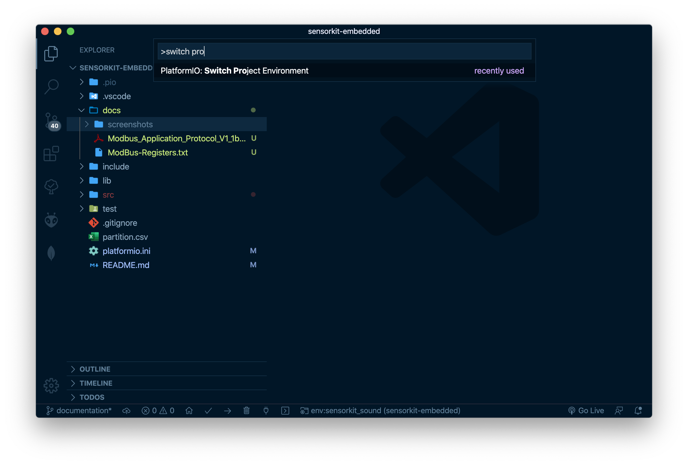

<p align="center">
  <a href="https://github.com/yetenek12/">
    
  </a>

  <h3 align="center">YETENEK-12</h3>

  <p align="center">
    SensorKit Projects
    <br>
    <a href="https://github.com/yetenek12/sensorkit-embedded/issues/new?template=bug.md">Report bug</a>
    ·
    <a href="https://github.com/yetenek12/sensorkit-embedded/issues/new?template=feature.md&labels=feature">Request feature</a>
  </p>
</p>

___

## Table of contents

- [Table of contents](#table-of-contents)
- [SensorKit Projects](#sensorkit-projects)
- [Repository Structure](#repository-structure)
- [Setup Project](#setup-project)
  - [Requirements](#requirements)
  - [Select Enviroment](#select-enviroment)
- [Add new SensorKit](#add-new-sensorkit)
  - [1. Import Library (optional)](#1-import-library-optional)
  - [2. Create Module Folder](#2-create-module-folder)
  - [3. Create Enviroment on platformio.ini file](#3-create-enviroment-on-platformioini-file)
  - [4. Implement common classes to main.cpp](#4-implement-common-classes-to-maincpp)
- [Developing existing SensorKit Projects](#developing-existing-sensorkit-projects)

___

## SensorKit Projects
| SensorKit  | Status    | Core                                                                                 | Library |
| ---------- | --------- | ------------------------------------------------------------------------------------ | ------- |
| Sound      | WIP       | [Source](https://github.com/yetenek12/sensorkit-embedded/tree/master/src/sound)      | WIP     |
| ToF        | WIP       | [Source](https://github.com/yetenek12/sensorkit-embedded/tree/master/src/tof)        | WIP     |
| ThermalCam | Prototype | [Source](https://github.com/yetenek12/sensorkit-embedded/tree/master/src/thermalcam) | WIP     |
| Air        | WIP       | [Source](https://github.com/yetenek12/sensorkit-embedded/tree/master/src/air)        | WIP     |


## Repository Structure

```text
docs/
├── screenshots/          => Screenshots about documentation
└── datasheets/           => Module datasheets

lib/
├── Common/               => Libraries that compatible with both STM32 and ESP32
├── ESP32/                => ESP32 specific libraries
└── STM32/                => STM32 specific libraries

src/
├── common/               => Library abstraction layer
│   └── Example           => Modules (example: Led, ModBus, I2C_Slave) Common modules for each sensorkit-project
│       ├── X.cpp
│       └── X.h
└── modules/
    ├── ExampleModule
        ├── main.cpp      => Source code for module
        ├── pin.h         => GPIO definitions for module
        ├── README.md     => SensorKit documentation
        └── src           => Module specific classes (example: AMG.h, ToF.h)
            ├── X.cpp
            └── X.h

platform.ini              => SensorKit Enviroments
partition.csv             => ESP32 Partition Schema (Big App 4 MB)
```


## Setup Project

### Requirements
- Visual Studio Code
  - PlatformIO IDE (2.3.0)
    - PlatformIO Espressif 32 Platform (automatic installation)
    - PlatformIO STM32 Platform (automatic installation)

### Select Enviroment

Press ```CMD+Shift+P (on mac)``` or ```Control+Shift+P (on windows)``` and type **Switch Platform Enviroment**



## Add new SensorKit

### 1. Import Library (optional)
### 2. Create Module Folder
### 3. Create Enviroment on platformio.ini file
Example Configuration
```
[env:sensorkit_XXX]
platform = espressif32
board = esp32dev
board_build.partitions = partition.csv
build_flags = 
  ${esp32_wrover.build_flags}
  -D DEBUG=1
lib_extra_dirs =
	${env.lib_extra_dirs}
	${esp32_wrover.lib_extra_dirs}
src_filter =
	${env.src_filter}
	+<modules/XXX/*>
```
### 4. Implement common classes to main.cpp
```
ex:
  Led.h
  ModBus.h
  I2C_Slave.h
```


## Developing existing SensorKit Projects

1. Create new feature branch
2. Push new features to new branch
3. Create pull request